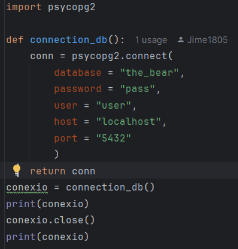

# sge_theBear_grupE

RESULTAT ACTIVITAT FASTAPI + BD:

ESTRUCTURA FINAL:

Este proyecto implementa una API REST utilizando FastAPI para la gestión de usuarios. Se incluyen endpoints para:

Obtener datos → GET /root, GET /users/

Crear un usuario → POST /users/

Actualizar datos de usuario → PUT /users/ y PUT /update_user/

Eliminar un usuario → DELETE /users/delete/

He fet l'apartat de models dels apartats que em tocaven a mi amb aquesta estructura 

Això es l'apartat de Schema, el qual ho he fet amb aquesta estructura per a tots els apartats que em tocaven