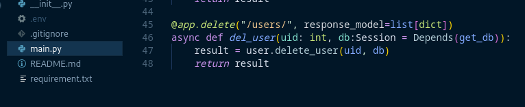

# sge_theBear_grupE

## FAST API PRIMERES PASSES

### Arxius
El primer pas per crear un projecte de FastAPI es crear una estructura de carpetes com diferents fitxers i utilitzar un fitxer buit "\_\_init__" a cada subcarpeta per poder accedir a l'altre desde altres carpetes.

A continuació s'escriuran els fitxers corresponents, començant per "connect.py". El codi d'aquest serà el mateix utilitzat a l'activitat anterior.

El següent fitxer a complir serà "read_sch.py" que s'encarregarà de transformar les dades de users en format List a un format de disccionari.

Seguidament s'escriurà el fitxer "read.py" amb tota aquella lògica que permetrà treballar amb les consultes del client.

L'últim fitxer a omplir és el "main.py" que decidira que farà el programa segons la consulta del client.

### Comprovació

Un cop tots els fitxers tenen el seu codi corresponent, s'executa la comanda "uvicorn main:app --reload" desde el directori principal del projecte, si uvicorn no està instal·lat cal fer-ho amb la comanda "pip install uvicorn".

Finalment, a la següent captura es pot veure com tot funciona correctament utilitzant la nostra adreça a un navegador i es pot executar per veure la resposta.

## FASTAPI + BD

### PAS A PAS
Per començar amb el projecte, s'ha creat un fitxer amb el nom "requirements.txt" amb els noms del requeriments que s'instal·laran a continuació amb la comanda "pip install -r requirements.txt".

Tot seguit es crea un fitxer .env amb la configuració del projecte per a la connexió amb la Base de Dades.

Un cop fet això, s'ha afegit codi a main.py per carregar algunes variables i crear automàticament les taules a la Base de dades.

Seguidament s'afegeix una carpeta de nom "models" i un fitxer de nom "User.py" amb codi per definir el model d'un usuari.

A continuació s'ha fet la modificació de l'endpoint read a l'arxiu main.py.

A l'arxiu user.py s'ha afegit el mètode "get_all_users" que s'ecarrega de fer la consulta a la BD.

Seguint a aquest arxiu, s'ha creat un nou mètode "add_new_user" per crear usuaris amb un endpoint al main.

Finalment es crea l'arxiu users_sch amb 2 funcions per consultar a la BD en un format json.

### Comprovació

Un cop acabat, es fa la comprovació novament amb la comanda "uvicorn main:app --reload"

## CRUD
En aquesta activitat es faràn consultes a la Base de Dades CRUD (Create, Read, Update i Delete), a l'activitat anterior s'ha fet Create i Read i per tant ara es faran les 2 restants començant per Update.

### PAS A PAS
Per fer la consulta Update es comença definint l'endpoint a main.py amb el decorador @app.put(). En aquest cas es que s'actualitzarà serà l'email de l'usuari.

També es crearà una funció async def que trucarà al mètode de la funció user per passar l'usuari que es vol modificar utilitzant el seu id (uid) i el nom email (email) com a paràmetres.

Aquesta funció es troba a "services/user.py" i troba l'usuari que tingui el mateix id que el parametre passat i actualitza l'email d'aquest. Al final es retorna que s'ha actualitzat l'email correctament.

La segona i ultima consulta s'ha fet el el Delete i es fà de la mateixa forma que l'update, amb un endpoint a main.py que crida una funció de user.py.

### Comprovació

Per comprovar que els canvis s'han fet correctament, es torna a executar la comanda "uvicorn main:app --reload".

