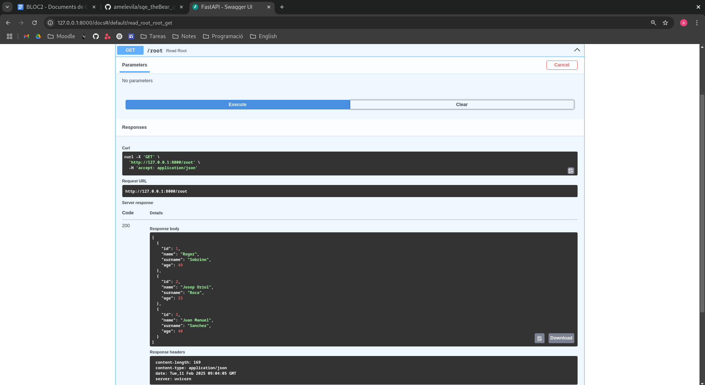

# sge_theBear_grupE

## PAS A PAS

### Arxius
El primer pas per crear un projecte de FastAPI es crear una estructura de carpetes com diferents fitxers i utilitzar un fitxer buit "\_\_init__" a cada subcarpeta per poder accedir a l'altre desde altres carpetes.

A continuació s'escriuran els fitxers corresponents, començant per "connect.py". El codi d'aquest serà el mateix utilitzat a l'activitat anterior.

El següent fitxer a complir serà "read_sch.py" que s'encarregarà de transformar les dades de users en format List a un format de disccionari.

Seguidament s'escriurà el fitxer "read.py" amb tota aquella lògica que permetrà treballar amb les consultes del client.

L'últim fitxer a omplir és el "main.py" que decidira que farà el programa segons la consulta del client.

### Comprovació

Un cop tots els fitxers tenen el seu codi corresponent, s'executa la comanda "uvicorn main:app --reload" desde el directori principal del projecte, si uvicorn no està instal·lat cal fer-ho amb la comanda "pip install uvicorn".

Finalment, a la següent captura es pot veure com tot funciona correctament utilitzant la nostra adreça a un navegador i es pot executar per veure la resposta.

